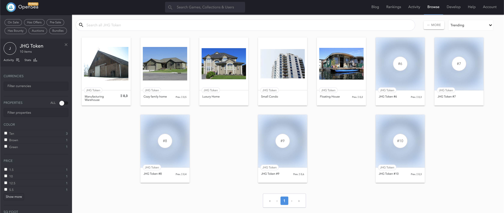
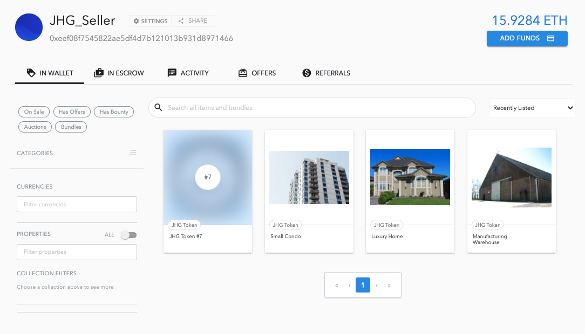
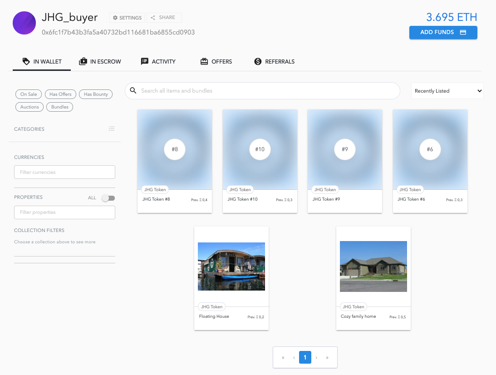
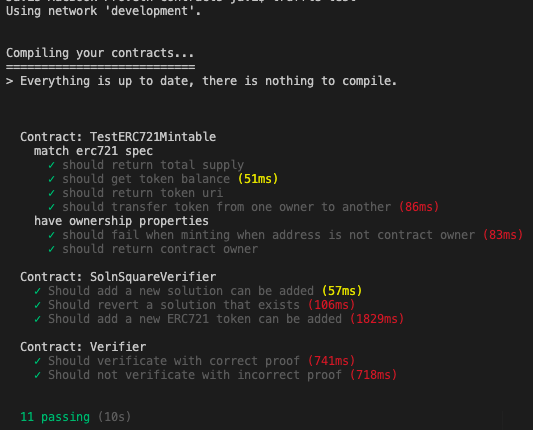

# Udacity Blockchain Capstone

The capstone will build upon the knowledge you have gained in the course in order to build a decentralized housing product.

---

## Token

Name: JHG Token  
Symbol: JHG  
Contract Address: 0x7602766dA2d3b0db8bdA1B9C9D8CABc54595c9C5

JHG Token: https://rinkeby.etherscan.io/token/0x7602766da2d3b0db8bda1b9c9d8cabc54595c9c5

---

## Deploy Log

Log is available in this [link](deploy.log)

---

## OpenSea

JHG Token Store: https://rinkeby.opensea.io/assets/jhg-token



JHG_seller: 0xeeF08f7545822AE5Df4d7B121013B931d8971466



JHG_buyer: 0x6fc1f7B43b3Fa5a40732Bd116681ba6855CD0903



---

## Test and Deploy

```
$ npm install
```

Create two files inside eth-contracts folder:

- .secret: with the words to create addresses
- .infura: with your infura API key

```
$ cd eth-contract
eth-contract $ truffle test
```



To deploy

```
eth-contract $ truffle migrate --network rinkeby
```

---

## Dapp

To create token you can use the basic dapp

```
$ cd dapp
dapp $ yarn install
dapp $ yarn start
```

You should see in the browser on localhost:3000 something like:


# Project Resources

- [Remix - Solidity IDE](https://remix.ethereum.org/)
- [Visual Studio Code](https://code.visualstudio.com/)
- [Truffle Framework](https://truffleframework.com/)
- [Ganache - One Click Blockchain](https://truffleframework.com/ganache)
- [Open Zeppelin ](https://openzeppelin.org/)
- [Interactive zero knowledge 3-colorability demonstration](http://web.mit.edu/~ezyang/Public/graph/svg.html)
- [Docker](https://docs.docker.com/install/)
- [ZoKrates](https://github.com/Zokrates/ZoKrates)
